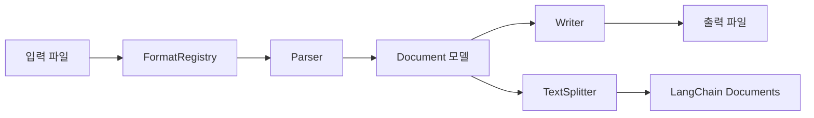
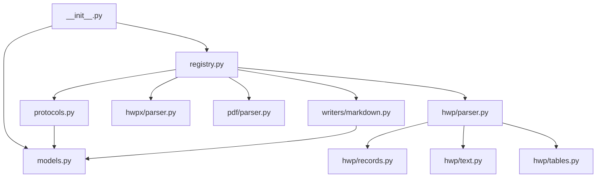

## 개요

Ureca Document Parser는 클린 아키텍처 기반의 다중 포맷 문서 파서예요. Protocol 기반 설계로 새로운 포맷 추가가 쉽고, 포맷 독립적인 Document 모델을 통해 일관된 변환 파이프라인을 제공해요.

## 파이프라인

전체 변환 과정은 다음과 같은 흐름으로 진행돼요:



<Steps>
  <Step title="파일 확장자 감지">
    `FormatRegistry`가 입력 파일의 확장자(`.hwp`, `.hwpx`, `.pdf`)를 확인하고 적절한 Parser를 선택해요.
  </Step>
  
  <Step title="파싱">
    선택된 Parser가 파일을 읽어 포맷 독립적인 `Document` 모델로 변환해요. 각 Parser는 자신의 포맷에 특화된 파싱 로직을 구현해요.
  </Step>
  
  <Step title="변환">
    Writer가 `Document` 모델을 받아 최종 출력 포맷(Markdown 등)으로 변환해요. 또는 LangChain의 TextSplitter를 사용해 청크로 분할할 수 있어요.
  </Step>
  
  <Step title="출력">
    변환된 결과를 파일로 저장하거나 문자열/청크 리스트로 반환해요.
  </Step>
</Steps>

## 핵심 모듈

### protocols.py

Parser와 Writer의 인터페이스를 Protocol로 정의해요. 상속 없이 구조적 서브타이핑(structural subtyping)만으로 확장할 수 있어요.

```python
class Parser(Protocol):
    @staticmethod
    def extensions() -> list[str]:
        """지원하는 파일 확장자 목록"""
        ...
    
    @staticmethod
    def parse(filepath: Path | str) -> Document:
        """파일을 파싱해 Document로 변환"""
        ...

class Writer(Protocol):
    @staticmethod
    def format_name() -> str:
        """출력 포맷 이름 (예: 'markdown')"""
        ...
    
    @staticmethod
    def write(doc: Document) -> str:
        """Document를 출력 포맷으로 변환"""
        ...
```

**설계 원칙:**
- 상속 없는 인터페이스 — Python의 구조적 서브타이핑 활용
- 정적 메서드만 사용 — 상태 없는 순수 변환 함수
- 타입 안전성 — `Protocol`로 정적 타입 체킹 지원

### registry.py

`FormatRegistry`는 확장자→Parser, 포맷명→Writer 매핑을 관리하는 중앙 레지스트리예요.

```python
class FormatRegistry:
    def __init__(self):
        self._parsers: dict[str, type[Parser]] = {}
        self._writers: dict[str, type[Writer]] = {}
    
    def register_parser(self, cls: type[Parser]) -> None:
        """Parser 클래스 등록"""
        for ext in cls.extensions():
            self._parsers[ext.lower()] = cls
    
    def parse(self, filepath: Path | str) -> Document:
        """확장자 기반 자동 파싱"""
        ext = Path(filepath).suffix.lower()
        parser_cls = self._parsers[ext]
        return parser_cls.parse(filepath)
```

**주요 기능:**
- **스레드 안전 싱글톤** — `get_registry()`로 전역 인스턴스 접근
- **자동 등록** — `_auto_register()`가 내장 Parser/Writer를 자동 등록
- **지연 초기화** — 첫 접근 시점에 레지스트리 생성

### models.py

포맷 독립적인 중간 표현(Intermediate Representation)을 정의해요. 모든 Parser는 자신의 포맷을 이 모델로 변환하고, 모든 Writer는 이 모델에서 출력을 생성해요.

```python
@dataclass
class Paragraph:
    text: str
    heading_level: int = 0  # 0=일반, 1-6=제목

@dataclass
class Table:
    rows: list[TableRow]

@dataclass
class Image:
    alt_text: str = ""
    source: str = ""
    data: bytes = b""

type DocumentElement = Paragraph | Table | Image | ListItem | Link | HorizontalRule

@dataclass
class Document:
    elements: list[DocumentElement]
    metadata: Metadata
```

**설계 원칙:**
- **포맷 중립성** — HWP/HWPX/PDF 고유 속성 배제
- **단순성** — 최소한의 속성만 유지
- **확장성** — 새 요소 타입 추가 용이 (Union type)

## 파서별 구조

### HWP Parser

HWP v5 바이너리 포맷을 파싱해요. OLE2 컨테이너 구조를 사용하며, 여러 하위 모듈로 분리되어 있어요:

```
hwp/
├── parser.py   # 오케스트레이션 (전체 파싱 흐름)
├── records.py  # 바이너리 레코드 파싱
├── text.py     # 문자 추출 (UTF-16LE)
└── tables.py   # 3단계 테이블 추출 알고리즘
```

**파싱 단계:**
1. OLE2 스트림 열기 (olefile)
2. DocInfo에서 스타일 정보 추출
3. BodyText 섹션별 레코드 스트림 파싱
4. 테이블 셀 구조 재구성
5. PrvText 폴백 (파싱 실패 시)

### HWPX Parser

HWPX는 ZIP 기반 OPC(Open Packaging Convention) 포맷이에요. 표준 라이브러리만으로 파싱 가능해요:

```
hwpx/
└── parser.py  # ZIP + XML 파싱
```

**파싱 단계:**
1. ZIP 아카이브 열기
2. Contents/section*.xml 파일 탐색
3. XML 요소 순회 (`<p>`, `<tbl>` 등)
4. 제목 레벨 감지 (outlineLevel 속성)
5. 중첩 테이블 처리

### PDF Parser (선택적)

PyMuPDF(fitz)를 사용해 PDF 텍스트를 추출해요:

```
pdf/
└── parser.py  # PyMuPDF 기반 텍스트 추출
```

**특징:**
- 텍스트 레이어가 있는 PDF만 지원
- 페이지별 텍스트 추출 및 문단 분리
- 메타데이터 추출 (제목, 저자, 페이지 수)

## Writer 구조

### Markdown Writer

`Document` 모델을 Markdown으로 변환해요:

```python
class MarkdownWriter:
    @staticmethod
    def write(doc: Document) -> str:
        parts = []
        for elem in doc.elements:
            if isinstance(elem, Paragraph):
                if elem.heading_level:
                    parts.append(f"{'#' * elem.heading_level} {elem.text}")
                else:
                    parts.append(elem.text)
            elif isinstance(elem, Table):
                parts.append(_format_table(elem))
            # ...
        return "\n\n".join(parts)
```

**변환 규칙:**
- **제목** — `heading_level`에 따라 `#` 개수 조정
- **표** — 파이프 테이블 (중첩 표는 HTML)
- **목록** — 연속된 `ListItem`을 하나의 블록으로 그룹핑
- **이미지** — `` 형식

## 의존성 그래프



**계층 구조:**
- **공개 API** — `__init__.py` (사용자 진입점)
- **코어** — `registry.py`, `protocols.py`, `models.py`
- **파서** — `hwp/`, `hwpx/`, `pdf/` (플러그인 형태)
- **작성기** — `writers/` (플러그인 형태)

## 설계 원칙

<CardGroup cols={2}>
  <Card title="포맷 독립성" icon="arrows-split">
    Document 모델은 특정 포맷에 종속되지 않아요. HWP의 ShapeObject나 PDF의 Annotation 같은 포맷 고유 기능은 포함하지 않아요.
  </Card>
  
  <Card title="확장 가능성" icon="puzzle-piece">
    Protocol 기반 설계로 새 포맷 추가가 쉬워요. Parser/Writer 클래스만 작성하면 레지스트리가 자동으로 인식해요.
  </Card>
  
  <Card title="단일 책임" icon="bullseye">
    각 모듈은 하나의 명확한 역할만 수행해요. Parser는 파싱만, Writer는 변환만, Registry는 라우팅만 담당해요.
  </Card>
  
  <Card title="테스트 용이성" icon="flask">
    상태 없는 정적 메서드 기반 설계로 단위 테스트가 쉬워요. 의존성 주입 없이 각 모듈을 독립적으로 테스트할 수 있어요.
  </Card>
</CardGroup>

## 성능 고려사항

### 메모리

- **전체 로딩** — 파일 전체를 메모리에 로드해요 (스트리밍 미지원)
- **Document 크기** — 대용량 문서(100MB+)는 메모리 부족 가능

### 속도

- **HWP** — 바이너리 파싱이므로 상대적으로 빠름 (수 ms)
- **HWPX** — XML 파싱 오버헤드 (수십 ms)
- **PDF** — PyMuPDF 의존, 텍스트 추출 속도는 페이지 수에 비례

## 스레드 안전성

- **Registry** — `threading.Lock`으로 싱글톤 초기화 보호
- **Parser/Writer** — 정적 메서드만 사용하므로 상태 공유 없음
- **동시 변환** — 여러 스레드에서 `convert()` 호출 가능

## 다음 단계

<CardGroup cols={2}>
  <Card title="포맷 확장하기" icon="plus" href="/extending">
    새로운 Parser나 Writer를 추가하는 방법을 알아봐요
  </Card>
  
  <Card title="고급 사용법" icon="wand-magic-sparkles" href="/guides/advanced">
    Document 모델을 직접 다루고 커스텀 변환을 구현해봐요
  </Card>
  
  <Card title="API 레퍼런스" icon="code" href="/api/models">
    Document 모델과 Protocol의 전체 API를 살펴봐요
  </Card>
  
  <Card title="소스 코드" icon="github" href="https://github.com/ureca-corp/document_parser">
    GitHub에서 전체 소스 코드를 확인해봐요
  </Card>
</CardGroup>
